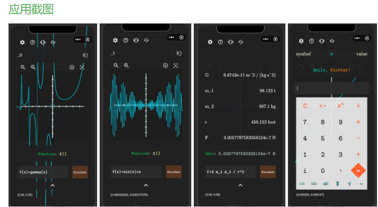

- Hi~ o(*￣▽￣*)ブ

I'm HK-SHAO and welcome to use Plotter!

Plotter is a modern, full-platform graphical computing system based on the game engine [Cocos Creator](https://www.cocos.com/) and the mathematical computing library [math.js](https://github.com/josdejong/mathjs). Download link for the Plotter Android App 🔗: https://www.coolapk.com/apk/284166

Let's start with what Plotter is: a lightweight, cross-platform, web-independent, portable scientific computing software. In fact Plotter is not a game, but **a very hardcore**, very few people want to do it, or do it well - numerical modelling software/calculators.

The features of Plotter make it aimed at users such as:

- **Primary and secondary school students:** four operations with units, simple function plotting, combinatorial operations, statistical operations

- **university students:** vector/matrix operations, numerical calculus, extrema of multivariate functions, etc.

- **Educators:** bring deeper concepts to students through imagery and more visualised operations

- **Engineers:** all platforms, regardless of the device, and can be run offline

- **Programmers:** conversions and operations between various bases, ultra-high precision floating point or large integer operations

- **Researchers:**
- Portability allows the device to be taken out for calculations and experiments whenever and wherever inspiration strikes
  - Unit-based operations allow researchers to perform calculations with units, convert values with units at any time, and ensure that there are no errors in scaling when calculating data.
- The introduction of high-precision unitary constants such as Planck's constant, Avogadro's constant, etc., at any time

#### Q&A

**Q:** Educators already have specialist software like Desmos and Geogebra, different engineers have specialist software for their fields and researchers have specialist tools like MATLAB, Mathematica and Python, what is the point of Plotter?

**A:** Plotter's vision is to make scientific computing simpler and easier; it encapsulates functionality that can be used in a variety of fields, making it accessible to a wide audience.

**Q:** What can be achieved by making scientific computing simpler and easier?

**A:** The rapid advances in modern science and technology have been made possible by the creation of computers. Both the sequencing of DNA and the simulation of protein structures have allowed modern biology to advance to a new stage, giving rise to bioinformatics. In the same way that the simulation of neurons in the brain has advanced brain science, the analysis of medical data has led to scientific discoveries that have benefited countless people suffering from disease. Finite element analysis has enabled us to simulate physical processes on computers and is widely used in industry. Simulation of the orbits of celestial bodies has led to what is now known as astronomy and astronautics. Simulation of the movement of chemical molecules has led to the discovery of new catalysts ...... I wonder how many scientists use MATLAB to analyse experimental data and how many mathematicians use Mathematica to perform symbolic operations.

So it can be said: new scientific discoveries are made in scientific computing driven by human ingenuity.

Stephen Wolfram, a computer scientist and particle physicist, has mentioned that computation itself is a new science and that pure computation may also discover the laws of the universe ......

Plotter is not that big, it is merely light, portable and offline, but its vision is still to make scientific computing simpler and easier.

#### A brief introduction

　　Plotter supports a very wide range of plotting methods

　　For example, plotting rectangular functions, polar functions, series, iterations, parametric equations, implicit functions, plane regions and histograms, scatterplots, line plots etc.

　　Plotter is fully 3D and will later support the plotting of spatial surfaces and curves.

　　Plotter supports complex numbers, matrices, units and symbols.

　　Plotter has 200+ built-in functions and nearly 100 mathematical and chemical constants

　　Functions for: algebra, arithmetic, trigonometry, bitwise operations, combinatorics, complex numbers, geometry, logic, matrices, probability statistics, relations, sets, strings, units, arrays and other system operations

　　Constants include: most unitless mathematical constants, physical constants with units and chemical constants

　　The physical constants include: cosmological constants, electromagnetic constants, atomic and nuclear constants, and physical-chemical constants.

　　The functions and constants supported by Plotter can be viewed by typing help() in the expression input box

　　Type help (the name of the function or constant) and you will find a detailed description of it and how to use it.

　　Plotter's features allow almost any data to be put into a matrix, not only does it support and most matrix operations in the same way as MATLAB

　　Plotter is also a compiler and interpreter for scientific computing languages.

#### The main interface

　　The main interface of Plotter is very simple.

　　At the top are the menu buttons, where you can open the settings page, go to the help page, adjust the vibration, restart the calculation engine, etc.

　　At the bottom is a list of registers to which variables generated during operations are added, which you can click to expand and refer to any of the lists in the registers at any time

　　In the middle are the function image axes and collimators, you can move the axes with one finger and scale them with two fingers. The buttons above the axes allow you to scale the axes or restore them.

　　Below the axes are the results of the operations, which you can expand by clicking on them.

　　Further down are the expression input box and the Calculate button, where you can enter an expression and it will be calculated immediately, and click on the Calculate button to store the result in a register.

　　By clicking on the up arrow button at the bottom, you can expand the keyboard and slide the input box to move the cursor.

　　The bottom left hand corner shows the coordinates of the current axis collimator.

#### Settings page

　　In the settings page you can make various settings for the calculation engine, which are effective immediately.

　　Plotter will later open up more settings options and provide more interfaces to allow a high degree of customisation.

#### Support us

　　Plotter is the product of weeks of hard work by first year students at South China Normal University and is supported on all platforms. This includes Windows, Android, IOS, web and WeChat applets.

　　Plotter is paid software, but the free version has no feature limitations, no account registration and no ads.

　　If you support the development of Plotter, you can sponsor the developer (WechatID: HK-SHAO) to help the developer continue to improve the software's features.

　　After appreciating the developer, you will receive the following benefits.

　　　　★ Receive a licence to use the software and a licence ID

　　　　★ Customise and compile and package a copy of the software for you

　　　　★ Access to software packages and licenses for other platforms

　　　　★ Be added to the thank you list in subsequent updates

　　　　★ Contact the developers and join the official discussion QQ group

### CN

- Hi~ o(*￣▽￣*)ブ

  　　我是 HK-SHAO ，欢迎你使用 Plotter ！

    　　Plotter 是一个现代化的全平台图形计算系统，它基于游戏引擎 [Cocos Creator](https://www.cocos.com/) 和数学计算库 [math.js](https://github.com/josdejong/mathjs) 开发。Plotter 安卓APP的下载链接🔗：https://www.coolapk.com/apk/284166

  

  先说Plotter是什么：一个轻量级、跨平台、不依赖网络的便携性科学计算软件。事实上Plotter不是一个游戏，而是一种**非常硬核，极少人愿意去做**、或者做的好的软件——数模软件/计算器。

  Plotter的特点使得它所面向的用户有：

  - 中小学生：带单位的四则运算、简单的函数绘图、组合学运算、统计学运算
  - 大学生：向量/矩阵的运算、数值微积分、多元函数的极值等
  - 教育工作者：通过图像和更具化的运算方式带给学生更深刻的概念
  - 工程师：全平台，无论在哪台设备都能允许，且可以脱机运行
  - 程序员：各种进制之间的转换和运算，超高精度浮点数或者大整数的运算
  - 科研人员：
    - 便携性使得无论何时何地产生了灵感，立马就可以拿出设备进行计算和实验
    - 带单位的运算使得科研人员能在计算时带单位运算，在任何时候可以进行带单位数值的转换，还使得在计算数据时保证量纲不出错
    - 在任何时候引入高精度带单位的常量进行运算，例如普朗克常数、阿伏伽德罗常数等

  **Q:** 教育工作者已经有像Desmos、Geogebra这样的专业软件了，不同的工程师也有各自领域的专业软件，科研工作者更是有像MATLAB、Mathematica、Python这样的专业工具了，那Plotter的意义何在？

  **A:** Plotter的愿景是让科学计算变的更加简单和容易。Plotter封装了不同领域都可能用到的功能，使其受众较广泛，其设计使得它能够在任何平台上脱机运行，尤其是移动端，这使得软件的通用性和便携性很强。

  **Q:** 让科学计算变的更加简单和容易能带来什么？

  **A:** 现代科学技术的突飞猛进离不开计算机的产生。无论是对DNA的测序还是蛋白质结构的模拟，让现代生物学突飞猛进发展到新的阶段，产生了生物信息学。同样对大脑神经元的模拟推进了脑科学的发展，对医药数据的分析带来的科学发现造福了无数疾病中的苦难人群。有限元分析使得我们能够在计算机上模拟物理过程，广泛运用于工业。对天体运行的模拟造就了现在的天文学和航天学。对化学分子运动的模拟而发现了新的催化剂......不知道多少科学家用MATLAB分析实验数据，多少数学家用Mathematica进行符号运算。

  因此可以说：新的科学发现是在以人类智慧驱动下的科学计算中产生的。

  计算机科学家、粒子物理学家 Stephen Wolfram 曾提到计算本身也是一种新科学，存粹的计算也可能发现宇宙的规律......

  Plotter的体量并没有那么大，它仅仅是做到了轻量便携和脱机而已，但它的愿景仍是使得科学计算变的更加简单和容易。

  #### 简要介绍

  　　Plotter 支持非常多种绘图方式

  　　例如直角坐标函数的绘图、极坐标函数的绘图，数列、迭代式的绘制、参数方程的绘制、隐函数的绘制、平面区域的绘制以及直方图、散点图、折线图等的绘制

  　　Plotter 是完全3D的，后继将会支持空间曲面、空间曲线的绘制

  　　Plotter 支持复数的运算、矩阵的运算、单位的运算和符号的运算

  　　Plotter 内置了200+种函数和近百种数理化常数

  　　函数包括了：代数、算数、三角学、位运算、组合学、复数、几何、逻辑、矩阵、概率统计、关系、集合、字符串、单位、数组和其它系统操作的函数

  　　常数包括了：大多数无单位的数学常数，带单位的物理常数和化学常数

  　　其中物理常数包括了：宇宙常数、电磁学常数、原子以及原子核常数、物理化学常数

  　　Plotter 所支持的函数和常数们，你可以在表达式输入框输入 help() 查看

  　　输入 help(函数名或者常数名) ，你可以看到它详细的介绍和使用方法

  　　Plotter 的特点几乎任何数据都可以放入矩阵，不仅支持且大部分矩阵运算的方法和 MATLAB 一致

  　　Plotter 同时还是一种面向科学计算的语言的编译器和解释器

  

  #### 主界面

  　　Plotter 的主界面非常简洁：

  　　最上方是菜单按钮，在这里你可以打开设置页面、进入帮助页面、调整震动、重启运算引擎等

  　　下方是一个寄存器列表，运算过程中产生的变量会被添加到列表，你可以点击展开列表，并且随时可以引用任何一个在寄存器中的列表

  　　中间是函数图像坐标轴和准星，你可以单指移动坐标轴，双指缩放坐标轴。坐标轴上方的按钮可以缩放坐标轴或者使坐标轴复原

  　　坐标轴下面是运算结果，你可以点击它展开

  　　再往下面是表达式输入框和运算按钮，输入表达式就会立刻被计算，点击计算按钮可以把运算结果存入寄存器

  　　点击最下方的向上箭头按钮，你可以展开输入键盘，滑动输入框可以移动光标

  　　最下面的左下角是当前坐标轴准星的坐标

  

  #### 设置页面

  　　在设置页面你可以对运算引擎的进行各种设置，这些设置是立即生效的

  　　Plotter 后继将会开放更多设置选项，并提供更多接口，允许用户高度自定义

  

  #### 支持我们

  　　Plotter 是华南师范大学大一学生艰苦奋斗数个星期的产物，它是全平台支持的。包括了 Windows、Android、IOS、网页和微信小程序

  　　Plotter 是付费软件，但是免费版无任何功能限制，不需要注册账号也没有任何广告

  　　如果您支持 Plotter 的后继开发，您可以赞助开发者（WechatID：HK-SHAO），以帮助开发者继续完善软件的功能

  　　赞赏开发者后，您将会得到以下权益：

  　　　　★ 获得软件使用授权和授权 ID

  　　　　★ 为你定制并编译打包一份软件

  　　　　★ 获得其它平台的软件包和使用授权

  　　　　★ 在后继的版本更新中加入感谢列表

  　　　　★ 联系开发者，并加入官方讨论QQ群